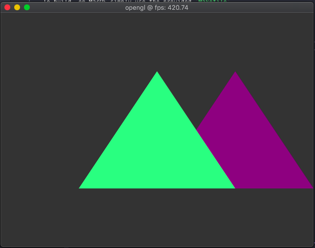

# Hello Triangle OpenGL 4.1 on MacOS


## To build, on MacOS simply use the provided `Makefile`
```
git clone git@github.com:paxsonsa/OpenGL4-HelloTriangles.git
cd OpenGL4-HelloTriangles
make && build/main
```